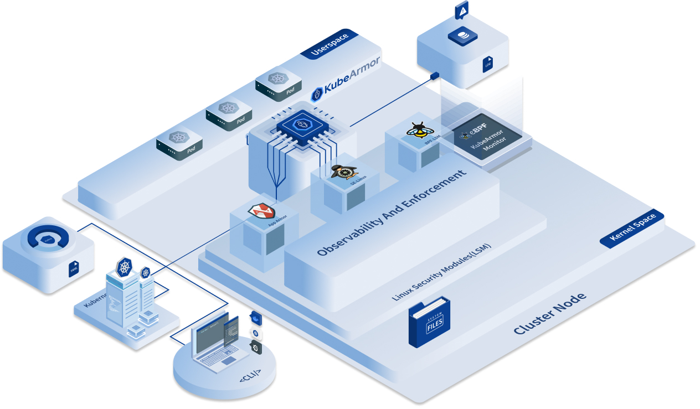

KubeArmor is a cloud-native runtime security enforcement system that restricts the behavior (such as process execution, file access, and networking operations) of pods, containers, and nodes (VMs) at the system level.

### Architecture Overview

